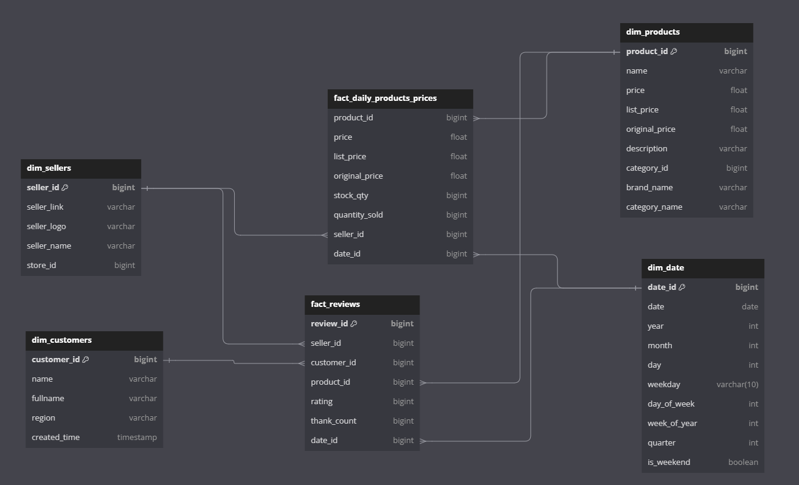

# Getting product data from tiki.vn then load to pgsql with Apache Airflow and Spark.

Using airflow to schedule spark jobs to run daily to get products information from tiki.vn.

### Data warehouse design:
Starschema with 2 fact tables, 3 dim tables (photo below)

### Steps of the pipeline:
    
    This pipeline is coordinated by Airflow to schedule daily runs.
    1. Used python to fetch api data from tiki.vn
    2. Transfrom that data (Pyspark)
    3. Load into DWH (Postgres)

### Technologies used:
    Python, Spark, Postgres, Docker, Airflow Git