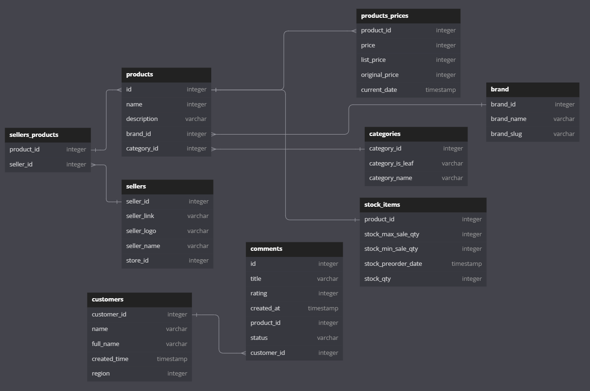

# Getting product data from tiki.vn then load to pgsql with Apache Airflow and Spark.

Using airflow to schedule spark jobs to run daily to get products information from tiki.vn.


### Schema data from api:

* product schema:

```
root
 |-- all_time_quantity_sold: long (nullable = true)
 |-- badges: array (nullable = true)
 |    |-- element: struct (containsNull = true)
 |    |    |-- code: string (nullable = true)
 |    |    |-- text: string (nullable = true)
 |-- badges_new: array (nullable = true)
 |    |-- element: struct (containsNull = true)
 |    |    |-- background_color: string (nullable = true)
 |    |    |-- code: string (nullable = true)
 |    |    |-- href: string (nullable = true)
 |    |    |-- icon: string (nullable = true)
 |    |    |-- icon_height: long (nullable = true)
 |    |    |-- icon_width: long (nullable = true)
 |    |    |-- placement: string (nullable = true)
 |    |    |-- text: string (nullable = true)
 |    |    |-- text_color: string (nullable = true)
 |    |    |-- type: string (nullable = true)
 |-- benefits: array (nullable = true)
 |    |-- element: struct (containsNull = true)
 |    |    |-- cta: struct (nullable = true)
 |    |    |    |-- text: string (nullable = true)
 |    |    |    |-- type: string (nullable = true)
 |    |    |-- icon: string (nullable = true)
 |    |    |-- sub_text: array (nullable = true)
 |    |    |    |-- element: string (containsNull = true)
 |    |    |-- text: string (nullable = true)
 |-- book_cover: string (nullable = true)
 |-- brand: struct (nullable = true)
 |    |-- id: long (nullable = true)
 |    |-- name: string (nullable = true)
 |    |-- slug: string (nullable = true)
 |-- breadcrumbs: array (nullable = true)
 |    |-- element: struct (containsNull = true)
 |    |    |-- category_id: long (nullable = true)
 |    |    |-- name: string (nullable = true)
 |    |    |-- url: string (nullable = true)
 |-- categories: struct (nullable = true)
 |    |-- id: long (nullable = true)
 |    |-- is_leaf: boolean (nullable = true)
 |    |-- name: string (nullable = true)
 |-- current_seller: struct (nullable = true)
 |    |-- id: long (nullable = true)
 |    |-- is_best_store: boolean (nullable = true)
 |    |-- is_offline_installment_supported: string (nullable = true)
 |    |-- link: string (nullable = true)
 |    |-- logo: string (nullable = true)
 |    |-- name: string (nullable = true)
 |    |-- price: long (nullable = true)
 |    |-- product_id: string (nullable = true)
 |    |-- sku: string (nullable = true)
 |    |-- store_id: long (nullable = true)
 |-- data_version: long (nullable = true)
 |-- day_ago_created: long (nullable = true)
 |-- description: string (nullable = true)
 |-- discount: long (nullable = true)
 |-- discount_rate: long (nullable = true)
 |-- favourite_count: long (nullable = true)
 |-- gift_item_title: string (nullable = true)
 |-- has_buynow: boolean (nullable = true)
 |-- has_ebook: boolean (nullable = true)
 |-- highlight: struct (nullable = true)
 |    |-- items: array (nullable = true)
 |    |    |-- element: string (containsNull = true)
 |    |-- title: string (nullable = true)
 |-- id: long (nullable = true)
 |-- images: array (nullable = true)
 |    |-- element: struct (containsNull = true)
 |    |    |-- base_url: string (nullable = true)
 |    |    |-- is_gallery: boolean (nullable = true)
 |    |    |-- label: string (nullable = true)
 |    |    |-- large_url: string (nullable = true)
 |    |    |-- medium_url: string (nullable = true)
 |    |    |-- position: string (nullable = true)
 |    |    |-- small_url: string (nullable = true)
 |    |    |-- thumbnail_url: string (nullable = true)
 |-- installment_info_v2: string (nullable = true)
 |-- installment_info_v3: array (nullable = true)
 |    |-- element: struct (containsNull = true)
 |    |    |-- display_text: string (nullable = true)
 |    |    |-- icon: string (nullable = true)
 |    |    |-- summary: string (nullable = true)
 |    |    |-- title: string (nullable = true)
 |    |    |-- type: string (nullable = true)
 |    |    |-- url: string (nullable = true)
 |-- inventory: struct (nullable = true)
 |    |-- fulfillment_type: string (nullable = true)
 |    |-- product_virtual_type: string (nullable = true)
 |-- inventory_status: string (nullable = true)
 |-- inventory_type: string (nullable = true)
 |-- is_acoholic_drink: boolean (nullable = true)
 |-- is_baby_milk: boolean (nullable = true)
 |-- is_flower: boolean (nullable = true)
 |-- is_fresh: boolean (nullable = true)
 |-- is_gift_card: boolean (nullable = true)
 |-- is_seller_in_chat_whitelist: boolean (nullable = true)
 |-- is_tier_pricing_available: boolean (nullable = true)
 |-- is_tier_pricing_eligible: boolean (nullable = true)
 |-- list_price: long (nullable = true)
 |-- master_id: long (nullable = true)
 |-- meta_description: string (nullable = true)
 |-- meta_keywords: string (nullable = true)
 |-- meta_title: string (nullable = true)
 |-- name: string (nullable = true)
 |-- original_price: long (nullable = true)
 |-- other_sellers: array (nullable = true)
 |    |-- element: struct (containsNull = true)
 |    |    |-- id: long (nullable = true)
 |    |    |-- link: string (nullable = true)
 |    |    |-- logo: string (nullable = true)
 |    |    |-- name: string (nullable = true)
 |    |    |-- price: long (nullable = true)
 |    |    |-- product_id: string (nullable = true)
 |    |    |-- store_id: long (nullable = true)
 |-- price: long (nullable = true)
 |-- price_comparison: struct (nullable = true)
 |    |-- sub_title: string (nullable = true)
 |    |-- title: string (nullable = true)
 |-- product_links: array (nullable = true)
 |    |-- element: string (containsNull = true)
 |-- productset_group_name: string (nullable = true)
 |-- promitions: array (nullable = true)
 |    |-- element: string (containsNull = true)
 |-- quantity_sold: struct (nullable = true)
 |    |-- text: string (nullable = true)
 |    |-- value: long (nullable = true)
 |-- rating_average: double (nullable = true)
 |-- return_and_exchange_policy: string (nullable = true)
 |-- return_policy: struct (nullable = true)
 |    |-- body: array (nullable = true)
 |    |    |-- element: struct (containsNull = true)
 |    |    |    |-- content: array (nullable = true)
 |    |    |    |    |-- element: string (containsNull = true)
 |    |    |    |-- label: string (nullable = true)
 |    |-- cta: struct (nullable = true)
 |    |    |-- link: string (nullable = true)
 |    |    |-- text_button: string (nullable = true)
 |    |-- title: string (nullable = true)
 |-- review_count: long (nullable = true)
 |-- review_text: string (nullable = true)
 |-- salable_type: string (nullable = true)
 |-- seller: string (nullable = true)
 |-- services_and_promotions: array (nullable = true)
 |    |-- element: string (containsNull = true)
 |-- short_description: string (nullable = true)
 |-- short_url: string (nullable = true)
 |-- sku: string (nullable = true)
 |-- specifications: array (nullable = true)
 |    |-- element: struct (containsNull = true)
 |    |    |-- attributes: array (nullable = true)
 |    |    |    |-- element: struct (containsNull = true)
 |    |    |    |    |-- code: string (nullable = true)
 |    |    |    |    |-- name: string (nullable = true)
 |    |    |    |    |-- value: string (nullable = true)
 |    |    |-- name: string (nullable = true)
 |-- stock_item: struct (nullable = true)
 |    |-- max_sale_qty: long (nullable = true)
 |    |-- min_sale_qty: long (nullable = true)
 |    |-- preorder_date: string (nullable = true)
 |    |-- qty: long (nullable = true)
 |-- thumbnail_url: string (nullable = true)
 |-- tracking_info: struct (nullable = true)
 |    |-- amplitude: struct (nullable = true)
 |    |    |-- is_hero: boolean (nullable = true)
 |    |    |-- return_reason: string (nullable = true)
 |-- type: string (nullable = true)
 |-- url_key: string (nullable = true)
 |-- url_path: string (nullable = true)
 |-- warranty_info: array (nullable = true)
 |    |-- element: struct (containsNull = true)
 |    |    |-- name: string (nullable = true)
 |    |    |-- url: string (nullable = true)
 |    |    |-- value: string (nullable = true)
 |-- warranty_policy: string (nullable = true)

```

* review:

```
root
 |-- attributes: array (nullable = true)
 |    |-- element: string (containsNull = true)
 |-- comment_count: long (nullable = true)
 |-- comments: array (nullable = true)
 |    |-- element: struct (containsNull = true)
 |    |    |-- avatar_url: string (nullable = true)
 |    |    |-- badge: string (nullable = true)
 |    |    |-- commentator: string (nullable = true)
 |    |    |-- content: string (nullable = true)
 |    |    |-- create_at: long (nullable = true)
 |    |    |-- customer_id: long (nullable = true)
 |    |    |-- fullname: string (nullable = true)
 |    |    |-- id: long (nullable = true)
 |    |    |-- is_reported: boolean (nullable = true)
 |    |    |-- review_id: long (nullable = true)
 |    |    |-- score: long (nullable = true)
 |    |    |-- status: long (nullable = true)
 |-- content: string (nullable = true)
 |-- created_at: long (nullable = true)
 |-- created_by: struct (nullable = true)
 |    |-- avatar_url: string (nullable = true)
 |    |-- contribute_info: struct (nullable = true)
 |    |    |-- avatar: string (nullable = true)
 |    |    |-- id: long (nullable = true)
 |    |    |-- name: string (nullable = true)
 |    |    |-- summary: struct (nullable = true)
 |    |    |    |-- joined_time: string (nullable = true)
 |    |    |    |-- total_review: long (nullable = true)
 |    |    |    |-- total_thank: long (nullable = true)
 |    |-- created_time: string (nullable = true)
 |    |-- full_name: string (nullable = true)
 |    |-- group_id: long (nullable = true)
 |    |-- id: long (nullable = true)
 |    |-- name: string (nullable = true)
 |    |-- purchased: boolean (nullable = true)
 |    |-- purchased_at: long (nullable = true)
 |    |-- region: string (nullable = true)
 |-- customer_id: long (nullable = true)
 |-- delivery_rating: array (nullable = true)
 |    |-- element: string (containsNull = true)
 |-- id: long (nullable = true)
 |-- images: array (nullable = true)
 |    |-- element: struct (containsNull = true)
 |    |    |-- full_path: string (nullable = true)
 |    |    |-- id: long (nullable = true)
 |    |    |-- status: string (nullable = true)
 |-- is_photo: boolean (nullable = true)
 |-- new_score: double (nullable = true)
 |-- product_attributes: array (nullable = true)
 |    |-- element: string (containsNull = true)
 |-- product_id: long (nullable = true)
 |-- rating: long (nullable = true)
 |-- score: double (nullable = true)
 |-- seller: struct (nullable = true)
 |    |-- id: long (nullable = true)
 |    |-- logo: string (nullable = true)
 |    |-- name: string (nullable = true)
 |-- spid: long (nullable = true)
 |-- status: string (nullable = true)
 |-- suggestions: array (nullable = true)
 |    |-- element: string (containsNull = true)
 |-- thank_count: long (nullable = true)
 |-- thanked: boolean (nullable = true)
 |-- timeline: struct (nullable = true)
 |    |-- content: string (nullable = true)
 |    |-- current_date: string (nullable = true)
 |    |-- delivery_date: string (nullable = true)
 |    |-- explain: string (nullable = true)
 |    |-- review_created_date: string (nullable = true)
 |-- title: string (nullable = true)
 |-- vote_attributes: struct (nullable = true)
 |    |-- agree: array (nullable = true)
 |    |    |-- element: string (containsNull = true)
 |    |-- disagree: array (nullable = true)
 |    |    |-- element: string (containsNull = true)

```

### Database design:

